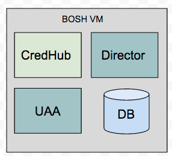
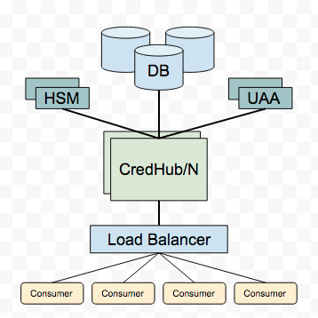

# CredHub Documentation

This repository contains documentation pertinent to the configuration and deployment of CredHub via BOSH. Additional documentation related to general application operation and features can be found in the [application repo.](https://github.com/cloudfoundry-incubator/credhub/tree/master/docs)

### Deployment architecture

The two primary architectures for CredHub are co-located on a consumer VM or an independently deployed and managed service. 

#### Co-location

The config server implementation of the BOSH Director uses the co-location architecture. This is appropriate for this application, given its single instance and unique bootstrap problem of deploying itself as the first VM in an environment. 

This architecture benefits from low latency and simplicity for a single consumer. However, this is configuration is not appropriate where many consumers exist or high availabilty is required.

Additional information on deploying a BOSH Director with CredHub can be [found here](bosh-install-with-credhub.md) or you may review the [sample manifests.](../sample-manifests/bootstrap-bosh-director/)

#### Service

CredHub can also be deployed as an independent service on one or more VMs. The application does not hold state, so it may be scaled to multiple instances that share a common database cluster and encryption provider. 

This architecture benefits from high availability and scale, however, the additional cost and complexity may not be suitable for a single or small number of consumers. Sample manifests that deploy dedicated CredHub instances can be [found here.](../sample-manifests/)

### Troubleshooting

Errors during operation or deployment of CredHub should provide descriptive errors. In many cases, the error should provide insight into the how to resolve the issue. In some cases, you may need to review the application logs to locate the source of the issue. The [following document](deployment-troubleshooting-guide.md) contains a summmary of error cases and how to resolve them. If you are unable to solve your issue using this document or by reviewing logs, please file a [GitHub issue](https://github.com/pivotal-cf/credhub-release/issues/new). 

### Additional resources

#### SafeNet Luna HSM

CredHub release includes support for utilizing SafeNet Luna hardware security modules for encryption operations. When configured to use this provider, all encryption and decryption operations are performed by the HSM. CredHub supports a high availability HSM configuration that enables redundancy to maintain availability and key material in the event of a hardware failure. Because the encryption key cannot be extracted for backup you must take extra care to configure an HSM deployment with redundancy to protect your data, as [described here.](luna-key-safety.md) 

A tutorial on how to provision and configure an HSM can be [found here.](configure-luna-hsm.md) 

#### Backup and restore 

The CredHub application does not hold state, however, you must ensure its dependent components such as the database and encryption providers are backed up to prevent data loss in the event of failure. Additional information on backup and restore can be [found here.](backup-restore-recommendations.md)
